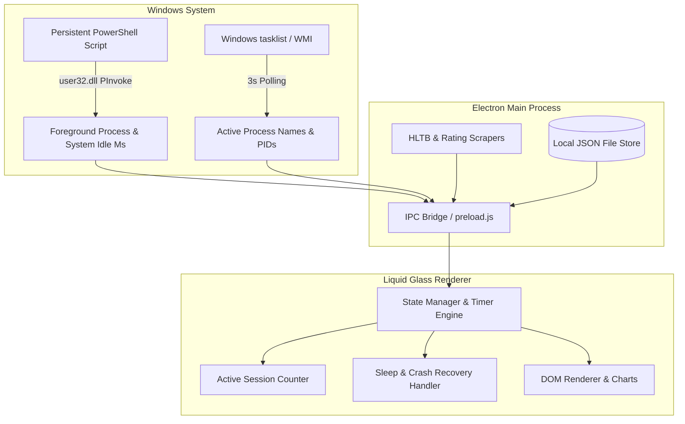

#  Game-Time Tracker

<p align="left">
  
  
  
  
  
  
</p>

**Game-Time Tracker** is a high-performance desktop application built with **Electron** and vanilla JavaScript/CSS that automatically tracks your PC gaming sessions. Running quietly as a background daemon in the Windows system tray, it dynamically handles idle pauses, Alt-Tab detection, and sleep/crash protection to ensure playtimes remain 100% accurate.

Beyond stopwatch tracking, it integrates directly with **HowLongToBeat** to benchmark your playtime against community completion targets, aggregates critic and user reviews across **Metacritic**, **IGN**, and **OpenCritic**, and provides dedicated sub-target tracking for **DLCs and Expansions**.

---

##  Key Features

###  Precision Session Tracking
-  **Automated Process Detection:** Scans running Windows executables every 3 seconds. Automatically starts the timer upon launch and saves the session on exit.
-  **Smart AFK Detection:** Leverages low-level Windows API hooks (`user32.dll` via PowerShell) to monitor global mouse and keyboard inactivity. Automatically pauses the session when you step away.
-  **Alt-Tab Tolerance:** Watches the active foreground window. If you switch to another application past your configurable tolerance threshold, tracking pauses until focus returns.
-  **Sleep & Crash Protection:** Intelligent state recovery prevents offline sleep/hibernation hours from polluting records and safely recovers unfinished sessions after sudden system restarts.
-  **Launcher Hierarchy Support:** Recognizes child process hierarchies when games are launched via Steam, Epic Games Launcher, EA App, Riot Client, Ubisoft Connect, or Battle.net.

---

###  HowLongToBeat (HLTB) & Review Aggregation
-  **Completion Time Targets:** Search and match games with the HowLongToBeat database to display target completion hours for:
  - **Main Story**
  - **Main + Extras**
  - **100% Completionist**
-  **Automatic Artwork Sync:** Downloads official high-resolution game banners and box covers directly into your library.
-  **Multi-Source Review Aggregator:** Live critic and community scoring:
  - **Metacritic:** Official Metascore & User Score.
  - **IGN:** Review score with direct clickable review links.
  - **OpenCritic:** Top Critic Average & Critics Recommend percentage.

---

###  DLCs, Expansions & Sub-Targets
-  **Independent DLC Tracking:** Add expansions manually or import them directly from HowLongToBeat.
-  **Target Isolation:** Attribute playtime sessions specifically to the base game or a designated DLC to measure expansion completion progress.
-  **Batch Management:** Multi-select DLCs or sessions for bulk deletion and cleanup.

---

###  Manual Session Management
-  **Retroactive Logging:** Add past or offline gaming sessions using custom calendar and time picker controls.
-  **Granular Session History:** View full timestamps, durations, target tags, and daily/weekly play trends.

---

###  Desktop Experience & System Integration
-  **Liquid Glass Aesthetic:** Dark-mode frosted glass interface (`backdrop-filter: blur(28px)`), fluid hover micro-animations, and vector outline SVG typography.
-  **System Tray Daemon:** Minimize to tray on close, live tray tooltips displaying current game and playtime, and quick tray actions.
-  **Windows Startup:** Option to launch minimized to tray on system boot.
-  **Anti-Cheat Safe Shell Launching:** Spawns games directly via Windows Shell (`explorer.exe`) to detach them from the Node.js process tree, ensuring full compatibility with Easy Anti-Cheat, BattlEye, and Vanguard.
-  **Built-in Auto Updater:** Integrated with `electron-updater` to check GitHub Releases and notify you when an update is ready.
-  **Bilingual Interface:** Instant language toggle between English and Türkçe in settings.

---

##  Under the Hood

The tracking engine coordinates several decoupled services across the Electron Main and Renderer processes:



1. **Process List Scanning (`tasklist`):**
   Scans active executables every **3 seconds**. If no tracked games are configured or currently open, poller cycles dynamically throttle to minimize background CPU usage.
2. **Foreground & Input Watcher:**
   A persistent background PowerShell process queries `user32.dll` (`GetForegroundWindow`, `GetWindowThreadProcessId`, `GetLastInputInfo`) every **1 second** without administrative elevation.
3. **Launch Grace Period & Immediate Saving:**
   Accommodates slow-loading titles with an initial grace window. As soon as gameplay processes establish focus, saves are synchronized immediately upon process termination or Alt-Tab timeout.

---

##  Getting Started

### Prerequisites
- **Operating System:** Windows 10 or 11 (64-bit)
- **Runtime:** [Node.js](https://nodejs.org/) (v18.0.0 or higher recommended)

### Installation
1. Clone this repository:
   ```bash
   git clone https://github.com/ertandev/Game-Time-Tracker.git
   cd Game-Time-Tracker
   ```
2. Install npm dependencies:
   ```bash
   npm install
   ```

### Running in Development
Start the application in development mode:
```bash
npm start
```

### Running Unit Tests
Execute the native Node.js test suite covering time mathematics, state mutations, HLTB parsing, and shutdown recovery:
```bash
npm test
```

### Building the Windows Installer
Compile an offline standalone NSIS installer (`GameTime-Tracker-Setup-1.8.0.exe`):
```bash
npm run dist
```
The compiled installer will be generated in the `dist/` directory.

---

##  Global Configuration

Access the **Settings Modal** from the top right titlebar gear icon:

| Setting | Default | Description |
| :--- | :--- | :--- |
| **In-Game AFK Timeout** | 10 minutes | System idle duration before auto-pausing the stopwatch. Set to `0` to disable. |
| **Alt-Tab Tolerance** | 2 minutes | Maximum duration the game can remain in the background before pausing. Set to `0` to disable. |
| **Auto-Save on Close** | Enabled | Automatically concludes and stores the session when the game closes. |
| **Run at Startup** | Disabled | Automatically boots the app minimized to the system tray on Windows login. |
| **Close to Tray** | Enabled | Hitting the `✕` button hides the window to the system tray instead of closing. |
| **Language** | Türkçe | Toggle application language between **Türkçe** and **English**. |
| **Maintenance** | — | One-click options to reset settings or clear all games and recorded sessions. |

---

##  Project Structure

```text
Game-Time-Tracker/
├── main.js               # Electron main process, OS API hooks, HLTB & ratings IPC handlers, tray & auto-updater
├── preload.js            # Secure IPC bridge exposing protected APIs to renderer
├── app.js                # App lifecycle bootstrapper, modal controller, event listeners
├── state.js              # Centralized state management, local JSON persistence, duration math, crash recovery
├── timer.js              # Precision stopwatch engine, AFK threshold checks, Alt-Tab tracker
├── renderer.js           # Liquid Glass UI view rendering (games sidebar, HLTB cards, stats, sessions list)
├── settings.js           # Settings manager, auto-launch hooks, close-to-tray handling
├── i18n.js               # Localization dictionary (English & Türkçe) and text switchers
├── index.html            # Main UI markup with Liquid Glass components, modals, and context menus
├── style.css             # Glassmorphism theme, CSS variables, responsive layout, animations
├── installer.nsh         # Custom NSIS script for Windows registry keys and startup shortcuts
├── installer_sidebar.bmp # Installer sidebar branding artwork
├── icon.ico / icon.png   # Application icons
├── package.json          # Project metadata, dependencies, electron-builder build config
├── tests/
│   └── test_suite.js     # 21 automated unit tests (time math, validation, HLTB, i18n, crash recovery)
└── README.md             # Project documentation
```

---

##  License

This project is licensed under the ISC License. See the [package.json](package.json) file for details.
